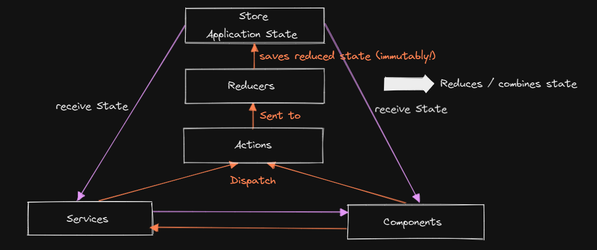
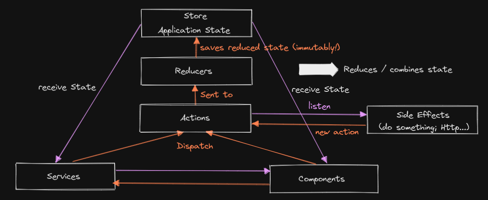

# NGRX

## Redux


## NgRx


Differences to 'normal' Redux:
- deeply integrated into Angular
- uses RxJS
- uses TypeScript

## Install NgRx

`npm install --save @ngrx/store`

## The reducer
... is just a function. Gets 2 parameters passed into:
- initial State
- Action

@see the shopping-list.reducer.ts:
```ts
import { Action } from '@ngrx/store';

import { Ingredient } from '../shared/ingredient.model';

const initialState = {
  ingredients: [
    new Ingredient('Apples', 5),
    new Ingredient('Tomatoes', 10),
  ]
};

export function shoppingListReducer(state = initialState, action: Action) {
  switch (action.type) {
    case 'ADD_INGREDIENT':
      return {
        ...state,
        ingredients: [...state.ingredients, action]
      };
  }
}
```
## Actions


# NgCompleteGuideUpdate

This project was generated with [Angular CLI](https://github.com/angular/angular-cli) version 7.3.5.

## Development server

Run `ng serve` for a dev server. Navigate to `http://localhost:4200/`. The app will automatically reload if you change any of the source files.

## Code scaffolding

Run `ng generate component component-name` to generate a new component. You can also use `ng generate directive|pipe|service|class|guard|interface|enum|module`.

## Build

Run `ng build` to build the project. The build artifacts will be stored in the `dist/` directory. Use the `--prod` flag for a production build.

## Running unit tests

Run `ng test` to execute the unit tests via [Karma](https://karma-runner.github.io).

## Running end-to-end tests

Run `ng e2e` to execute the end-to-end tests via [Protractor](http://www.protractortest.org/).

## Further help

To get more help on the Angular CLI use `ng help` or go check out the [Angular CLI README](https://github.com/angular/angular-cli/blob/master/README.md).
